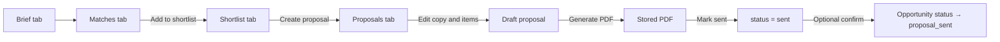

# R3 Proposal Generator — Implementation Plan

**Document type:** Release specification (R3)  
**Status:** Approved for implementation (plan only — no application code yet)  
**Entry point:** Opportunity Workspace — `/admin/opportunities/M######?tab=proposals`  
**Prerequisite:** R2 Smart Matching complete (`lib/matchPremises.ts`, Shortlist tab, Match Board)

**Related specs:**

- [engineering-execution-plan.md](./engineering-execution-plan.md) — Phases 43–44, AD-6, feature flags
- [advisory-workspace-ux.md](./advisory-workspace-ux.md) — Workspace tabs and shell
- [property-classification.md](./property-classification.md) — Category/type filters on shortlist and PDF
- [offer-matching.md](./offer-matching.md) — Upstream matching → shortlist flow
- [business-id-architecture.mdc](../.cursor/rules/business-id-architecture.mdc) — Frozen ID rules

**Constraint:** Upgrade only — extend existing Next.js App Router, server actions, `lib/repos/*`, raw SQL via `pg`. No new ORM, microservices, or parallel proposal stack.

---

## Executive summary

R3 delivers a **draft → edit → PDF → sent** proposal workflow inside the Opportunity Workspace. Proposals attach to **legacy `opportunities`** (numeric PK + business ID `M######`). Line items reference **`premises_v1.premises_id`** (display **`P######`** in PDF). Legacy mirror tables `proposals_v1` / `proposal_items_v1` remain **dormant**.

Feature flag: `PROPOSALS_ENABLED` (default `0` until staging sign-off).

Suggested release tag: `v0.7-proposals`.

---

## 1. Proposal workflow

Workflow starts from the Opportunity Workspace after a deal has been briefed, matched (R2), and shortlisted.



### Stages

| Stage | Actor | System behaviour |
|-------|-------|------------------|
| **Shortlist** | Advisor | Curate premises via search, matches, or manual add (`opportunity_proposed_premises`) |
| **Create draft** | Advisor | Promote selected (or all eligible) shortlist rows → `opportunity_proposals` + items with snapshots |
| **Edit** | Advisor | Title, language, executive summary, item order, pricing overrides, pros/cons, recommended flag |
| **Generate PDF** | Advisor | Render from snapshots; store path in `output_file` |
| **Mark sent** | Advisor | Freeze proposal; set `sent_date`; optionally update opportunity status |
| **Revise** | Advisor | Clone sent proposal → new draft version; prior version → `superseded` |

### Prof Service opportunities

- **Matches** and **Shortlist** tabs are hidden (existing behaviour).
- **Proposals** tab remains available for advisory-only documents (no premises lines if none on shortlist).

### Out of scope (R3)

- Email delivery, client portal, e-signature
- AI-drafted copy (R4 paste flow only)
- Property workspace / media upload UI (UX-2)
- Migrating `proposals_v1` data
- Async job queue (PDF generated synchronously in server action with timeout)
- New business-ID prefix for proposals (internal numeric PK only)

---

## 2. Database changes

All DDL is **additive** (Phases 43–44). Register in [scripts/migrate.ts](../scripts/migrate.ts). Run `npm run db:backup` before production migrate.

### Phase 43 — `schema-migrate-phase43-opportunity-proposals.sql`

Create proposal header and line-item tables on **legacy opportunities**:

```sql
CREATE TABLE IF NOT EXISTS opportunity_proposals (
  id                       BIGSERIAL PRIMARY KEY,
  opportunity_id           BIGINT NOT NULL REFERENCES opportunities(id) ON DELETE CASCADE,
  title                    TEXT NOT NULL,
  proposal_date            DATE NULL,
  language                 TEXT NOT NULL DEFAULT 'en'
                           CHECK (language IN ('en', 'zh-Hant', 'zh-Hans')),
  status                   TEXT NOT NULL DEFAULT 'draft'
                           CHECK (status IN ('draft', 'sent', 'accepted', 'superseded')),
  version_number           INTEGER NOT NULL DEFAULT 1,
  supersedes_id            BIGINT NULL REFERENCES opportunity_proposals(id) ON DELETE SET NULL,
  prepared_for_company_id  BIGINT NULL REFERENCES companies(id) ON DELETE SET NULL,
  prepared_for_contact_id  BIGINT NULL REFERENCES contacts(id) ON DELETE SET NULL,
  template_key             TEXT NOT NULL DEFAULT 'default',
  executive_summary        TEXT NULL,
  consultancy_advice       TEXT NULL,
  output_file              TEXT NULL,
  sent_date                DATE NULL,
  remarks                  TEXT NULL,
  created_at               TIMESTAMPTZ NOT NULL DEFAULT NOW(),
  updated_at               TIMESTAMPTZ NOT NULL DEFAULT NOW()
);

CREATE TABLE IF NOT EXISTS opportunity_proposal_items (
  id                   BIGSERIAL PRIMARY KEY,
  proposal_id          BIGINT NOT NULL REFERENCES opportunity_proposals(id) ON DELETE CASCADE,
  premises_id          TEXT NOT NULL REFERENCES premises_v1(premises_id) ON DELETE RESTRICT,
  proposed_premises_id BIGINT NULL REFERENCES opportunity_proposed_premises(id) ON DELETE SET NULL,
  rank                 INTEGER NULL,
  recommended          BOOLEAN NOT NULL DEFAULT FALSE,
  recommendation_label TEXT NULL,
  display_rent         TEXT NULL,
  net_effective_rent   NUMERIC(14, 2) NULL,
  total_initial_cost   NUMERIC(14, 2) NULL,
  pros                 TEXT NULL,
  cons                 TEXT NULL,
  advisor_comment      TEXT NULL,
  created_at           TIMESTAMPTZ NOT NULL DEFAULT NOW(),
  updated_at           TIMESTAMPTZ NOT NULL DEFAULT NOW(),
  UNIQUE (proposal_id, premises_id)
);
```

**Indexes**

- `idx_opportunity_proposals_opp` on `(opportunity_id, created_at DESC)`
- `idx_opportunity_proposals_supersedes` on `supersedes_id`
- `idx_opportunity_proposal_items_proposal` on `(proposal_id, rank)`

**ID rule:** Proposals use internal `BIGSERIAL` PK. No new user-facing ID format without explicit approval. UI label: `title` + date + `v{n}`.

**Do not use:** `proposals_v1` / `proposal_items_v1` (FK → `opportunities_v1`; dormant per AD-6).

### Phase 44 — `schema-migrate-phase44-proposal-pricing.sql`

```sql
ALTER TABLE opportunity_proposal_items
  ADD COLUMN IF NOT EXISTS pricing_snapshot JSONB NULL,
  ADD COLUMN IF NOT EXISTS premises_snapshot JSONB NULL,
  ADD COLUMN IF NOT EXISTS media_snapshot JSONB NULL;
```

| Column | Purpose |
|--------|---------|
| `pricing_snapshot` | Immutable pricing numbers used in PDF (see §5) |
| `premises_snapshot` | Building/premises display fields at generation time (EN + ZH variants, area, category, business IDs) |
| `media_snapshot` | Selected images/files for PDF (see §6) |

### Current live tables (unchanged)

| Table | Role in R3 |
|-------|------------|
| `opportunity_proposed_premises` | Shortlist source for promotion |
| `premises_v1` ⋈ `properties_v1` | Live supply read at snapshot time only |
| `opportunities` | Parent deal; optional status bump to `proposal_sent` |

---

## 3. Versioning approach

Each row in `opportunity_proposals` is one **version document**, linked by `supersedes_id`.

### Status model

| Status | Meaning |
|--------|---------|
| `draft` | Editable; PDF can be regenerated |
| `sent` | Frozen; `output_file` + `sent_date` set |
| `accepted` | Client accepted (manual mark) |
| `superseded` | Replaced by a newer version |

### Rules

1. **Create v1:** “New proposal” → `version_number = 1`, `status = draft`.
2. **Edit draft:** In-place update of header and items; regenerating PDF overwrites `output_file` for that version.
3. **Revise after send:** “Create revision” clones header + items → new row with `version_number = n + 1`, `supersedes_id = prior.id`; prior row → `superseded`. Old PDF retained on old row.
4. **Immutability:** Once `sent`, block item and pricing edits; only allow new revision or status → `accepted`.
5. **UI:** Proposals tab lists versions (newest first) with badge `v{n}` and status chip.

No separate `proposal_versions` table in R3 — version chain is self-contained in `opportunity_proposals`.

---

## 4. Shortlist to proposal flow

### Source of truth

- **Shortlist** = `opportunity_proposed_premises` (working set through sourcing/viewing).
- **Proposal items** = client-facing snapshot subset.

### Primary flow: Shortlist → Proposals

1. User selects rows on **Shortlist** tab (existing checkboxes) or uses “all eligible”.
2. Action: **Create proposal from selection**.
3. Server action `createProposalFromShortlistAction(opportunityId, lineIds?, options)`:
   - Default filter when no selection: `status IN ('shortlisted', 'presented', 'viewing')`.
   - Reject if zero eligible rows.
   - Insert `opportunity_proposals` draft.
   - For each shortlist line, insert `opportunity_proposal_items`:
     - `premises_id` ← shortlist `premises_id` (internal `premises_v1.premises_id`)
     - `rank` ← preference order or explicit rank
     - `advisor_comment` ← shortlist `advisor_comment`
     - `display_rent` ← formatted from `proposed_price` or live `monthly_rent`
     - `proposed_premises_id` ← shortlist line `id` (traceability)
   - Build `premises_snapshot`, `pricing_snapshot`, `media_snapshot` (see §5–6).
   - Redirect to `?tab=proposals&proposal=<id>`.

### Secondary flows

- **Proposals tab → add item:** Picker scoped to existing shortlist rows only (v1 — no free search).
- **Add to draft proposal:** Per-row action when a draft already exists for the deal.

### Category/type guard

When opportunity preferences are set, exclude shortlist rows whose `property_category` / `space_form` conflict with `property_category_preference` / `property_type_preference` (same hard-filter semantics as R2 matching). See [property-classification.md](./property-classification.md).

### Deletion semantics

- Removing a line from a **draft** proposal does not remove the shortlist row.
- Deleting a shortlist row does not delete items on **sent** proposals (snapshots are self-contained).

---

## 5. Pricing snapshot logic

### Module: `lib/pricing/netEffectiveRent.ts`

Compute from premises commercial fields + opportunity context at snapshot time.

| Input (premises_v1) | Input (opportunity) | Output |
|---------------------|---------------------|--------|
| `monthly_rent`, `rent_psf` | `budget_max`, `sales_role` | `face_rent`, `face_rent_psf` |
| `rent_free_period` | `lease_term` | `rent_free_months` (parsed) |
| `contract_term_months` | — | `term_months` |
| `management_fee`, `deposit_months` | — | `management_fee`, `deposit_months` |
| `currency` | — | `currency` (default HKD) |
| — | — | `net_effective_rent`, `total_initial_cost` |

### NER formula (v1 — lease deals)

```
NER = (face_rent × (term_months − rent_free_months) + management_fee × term_months)
      / term_months

total_initial_cost = deposit + first month + (fit-out allowance if recorded)
```

**Sale deals:** snapshot `asking_sale_price`, `sale_price_psf`; NER fields null.

### `pricing_snapshot` JSONB shape

```json
{
  "computed_at": "2026-08-06T12:00:00.000Z",
  "sales_role": "to_lease",
  "face_rent": 23500,
  "face_rent_psf": 45.5,
  "rent_free_months": 2,
  "term_months": 36,
  "management_fee": 1200,
  "deposit_months": 3,
  "net_effective_rent": 22100,
  "total_initial_cost": 85000,
  "asking_sale_price": null,
  "currency": "HKD",
  "display_rent": "HKD 23,500 / month",
  "overrides": {
    "display_rent": null,
    "net_effective_rent": null,
    "advisor_note": null
  }
}
```

### Rules

1. Snapshot written at **item add** and on **Recalculate pricing** (draft only).
2. **Editable on draft:** `display_rent`, `net_effective_rent`, `total_initial_cost`, `pros` / `cons` — stored on item row and mirrored in `pricing_snapshot.overrides`.
3. On **Generate PDF** or **Mark sent:** optional re-snapshot with user confirm; then freeze.
4. **PDF always reads `pricing_snapshot`**, never live `premises_v1` prices.

---

## 6. Media handling

### Current state

- No dedicated `premises_media` table.
- `premises_v1.source_file`, `source_url` — operator brochure paths/URLs.
- `relationship_lines` JSONB may include `source_file` / `source_url` per line.
- Legacy `proposal_items_v1.operator_source_file` is a field reference only.

### R3 v1 approach (no upload UI)

At proposal item creation, build `media_snapshot`:

```json
{
  "items": [
    {
      "kind": "photo",
      "url": "https://…",
      "source": "premises_source_url",
      "caption": "Lobby"
    }
  ],
  "captured_at": "2026-08-06T12:00:00.000Z"
}
```

**Resolution order (first N = 3 for PDF v1)**

1. `premises_v1.source_url` if absolute URL.
2. `premises_v1.source_file` if resolvable under `PROPOSAL_MEDIA_ROOT` (default `data/media/`).
3. First `relationship_lines` entry with `source_url` / `source_file`.

**PDF behaviour**

- Embed local images if file exists and size &lt; 2 MB; otherwise show linked URL text.
- Placeholder when no media: building name + category (no broken images).

**Proposal editor**

- Read-only media strip per line (“N images captured from supply record”).
- Checkbox per item: **Include photos in PDF** (default on when media exists).

**Post-R3:** `premises_media` table + Property workspace integration (UX-2).

---

## 7. Multilingual support

### Locales

| Code | Label | Use |
|------|-------|-----|
| `en` | English | Default |
| `zh-Hant` | Traditional Chinese | 繁體 |
| `zh-Hans` | Simplified Chinese | 简体 |

Stored on `opportunity_proposals.language`. Set at creation; changeable on draft only.

### Label dictionary

**New:** `lib/proposals/i18n.ts` — static strings for PDF sections and editor chrome (not full-app i18n):

- Section headers (Executive summary, Recommended options, Pricing, etc.)
- Table column labels, footnotes, date formats

### Entity field resolution

| Field | English | Traditional | Simplified |
|-------|---------|-------------|------------|
| Building | `properties_v1.bldg_name_en` | `bldg_name_zh` | `bldg_name_cn` |
| Premises | derived EN label | `premises_v1.property_name_zh` | fallback to EN |
| Company | `companies.company_name` | `company_name_zh` | `company_name_cn` |
| District | `district_en` | EN + translated label via dictionary (v1) | same |

**Fallback chain:** requested locale → English → raw field.

**Client hint:** `contacts.preferred_language` pre-fills proposal language when primary contact is set.

**Out of scope:** RTL, automatic translation API, admin UI locale switching.

---

## 8. PDF generation approach

### Stack

Use **Playwright** (already in `devDependencies`) server-side:

| Layer | File | Responsibility |
|-------|------|----------------|
| Template | `lib/proposals/templates/defaultProposal.tsx` | React → HTML (`renderToStaticMarkup`) |
| Render | `lib/proposals/renderProposalPdf.ts` | HTML + CSS → PDF via Playwright `page.pdf()` |
| Storage | `lib/proposalStorage.ts` | Write `data/proposals/{opportunityId}/{proposalId}-v{n}.pdf` |
| Download | `app/api/admin/proposals/[id]/pdf/route.ts` | Auth-guarded stream |

**Fonts:** Bundle or reference Noto Sans SC / Noto Sans TC in template CSS for CJK glyphs.

### Generation flow

1. Load proposal + items + opportunity + parties.
2. Merge snapshots only — no live price joins for display.
3. Render HTML with `language` prop.
4. Write PDF; update `output_file` (relative path).
5. Return download link in UI.

**Performance target:** &lt; 10 s for 5 items (staging smoke test).

**Security:** Files outside `public/`; served via authenticated API route only.

---

## 9. UI changes inside Opportunity Workspace

### Feature flag

`lib/proposals/proposalEngine.ts` — `isProposalsEnabled()` reads `PROPOSALS_ENABLED` (default `0`).

When off: retain current placeholder in Proposals tab; no errors from missing tables.

### URL convention

```
/admin/opportunities/M100001?tab=proposals&proposal=12
```

Uses existing [lib/opportunityWorkspaceNav.ts](../lib/opportunityWorkspaceNav.ts) tab routing + `proposal` query param.

### Proposals tab (desktop)

Replace `OpportunityProposalsTab` placeholder in [OpportunityNotesTab.tsx](../components/admin/opportunities/OpportunityNotesTab.tsx):

```
┌─────────────────────────────────────────────────────────────┐
│ [+ New proposal]  [From shortlist ▼]          Version list   │
├─────────────────────────────────────────────────────────────┤
│ Proposal editor (?proposal=id)                               │
│  · Title, date, language, prepared-for (company/contact)     │
│  · Executive summary, consultancy advice                     │
│  · Items table: rank, P-ID, building, pricing, recommended,  │
│    pros/cons, advisor comment                                │
│  · [Recalculate pricing] [Generate PDF] [Mark sent]         │
├─────────────────────────────────────────────────────────────┤
│ PDF download · Sent date                                     │
└─────────────────────────────────────────────────────────────┘
```

**Assist panel** (`WorkspaceContextPanel`): unchanged — AI placeholder only (R4).

### New components (planned)

| Component | Role |
|-----------|------|
| `OpportunityProposalsTab.tsx` | List + router for `?proposal=` |
| `OpportunityProposalList.tsx` | Version cards per deal |
| `OpportunityProposalEditor.tsx` | Header form + actions |
| `OpportunityProposalItemsTable.tsx` | Reorderable line items |
| `OpportunityProposalPreview.tsx` | Optional HTML preview (v1: PDF download sufficient) |

### Shortlist tab additions

- Bulk action: **Create proposal** (≥1 eligible row).
- Row action: **Add to draft proposal** when draft exists.

### Mobile

- v1: keep “desktop only” editor gate (matches current Proposals tab message).
- v1.1 (optional): read-only list + PDF download on mobile.

### Files to create / modify

| File | Action |
|------|--------|
| `scripts/schema-migrate-phase43-opportunity-proposals.sql` | **N** |
| `scripts/schema-migrate-phase44-proposal-pricing.sql` | **N** |
| `scripts/verify-opportunity-proposals.ts` | **N** |
| `lib/repos/opportunityProposals.ts` | **N** |
| `lib/pricing/netEffectiveRent.ts` | **N** |
| `lib/proposals/renderProposalPdf.ts` | **N** |
| `lib/proposals/templates/defaultProposal.tsx` | **N** |
| `lib/proposals/i18n.ts` | **N** |
| `lib/proposalStorage.ts` | **N** |
| `lib/proposals/proposalEngine.ts` | **N** — feature flag |
| `app/admin/opportunities/proposalActions.ts` | **N** |
| `components/admin/opportunities/OpportunityProposalsTab.tsx` | **N** (extract from NotesTab) |
| `components/admin/opportunities/OpportunityProposalEditor.tsx` | **N** |
| `components/admin/opportunities/OpportunityProposalItemsTable.tsx` | **N** |
| `components/admin/opportunities/OpportunityProposedPremisesTab.tsx` | **M** — create proposal action |
| `components/admin/opportunities/OpportunityWorkspacePageClient.tsx` | **M** — wire proposals tab + flag |
| `lib/repos/opportunityDetail.ts` | **M** — optional proposals preload |
| `lib/types/entities.ts` | **M** — proposal types |
| `scripts/migrate.ts` | **M** — register phases 43–44 |
| `package.json` | **M** — `verify:opportunity-proposals` |
| `.env.example` | **M** — `PROPOSALS_ENABLED`, `PROPOSAL_MEDIA_ROOT`, `PROPOSAL_STORAGE_DIR` |

---

## 10. Testing and rollback plan

### Automated verification (CI / pre-deploy)

| Command | Asserts |
|---------|---------|
| `npm run typecheck` | TypeScript clean |
| `npm run build` | Production build succeeds |
| `npm run verify:opportunity-proposals` | Create draft → items from fixture shortlist → snapshots populated → PDF path set → mark sent |
| Unit: `lib/pricing/netEffectiveRent.ts` | Face rent, rent-free, term, NER edge cases |
| Unit: `lib/proposals/i18n.ts` | All three locales return labels |
| Unit: `lib/proposals/renderProposalPdf.ts` | HTML structure snapshot (no pixel diff required) |
| `npm run db:full-reconciliation` | New tables registered |

### Manual QA checklist (staging)

- [ ] Create proposal from 3 shortlisted premises on a lease deal
- [ ] Reorder items; mark one **recommended**
- [ ] Switch language to zh-Hant → PDF shows Traditional building/company names
- [ ] Edit `display_rent` override → PDF reflects override, not live premises rent
- [ ] Generate PDF → download works; `output_file` persisted
- [ ] Mark sent → `status` + `sent_date`; editing blocked
- [ ] Create revision v2 → v1 superseded; both PDFs retained
- [ ] `PROPOSALS_ENABLED=0` → placeholder returns; no 500 errors
- [ ] Business IDs (`P######`, `M######`) in PDF; no numeric PKs exposed
- [ ] Category/type guard excludes mismatched shortlist rows when preferences set

### Performance smoke (staging, ~5 items)

| Operation | Target |
|-----------|--------|
| Load proposals list | &lt; 500 ms |
| Create proposal | &lt; 2 s |
| PDF generation | &lt; 10 s |

### Rollback procedure

| Symptom | First action | Data rollback? |
|---------|--------------|----------------|
| UI / PDF bug only | Set `PROPOSALS_ENABLED=0`; redeploy | No |
| Bad migration | Restore pre-migrate backup | **Yes** |
| Corrupt PDF files | Delete files under `data/proposals/` | PDF files only |

**Application rollback**

```bash
git checkout <last-good-tag>
npm ci && npm run build
# Set PROPOSALS_ENABLED=0 in environment
```

**Schema rollback (last resort only)**

`scripts/rollback-phase43-proposals.sql`:

```sql
DROP TABLE IF EXISTS opportunity_proposal_items;
DROP TABLE IF EXISTS opportunity_proposals;
```

Forward-fix preferred over `DROP COLUMN` (additive-only policy for phases 38–45).

### Acceptance criteria (R3-AC)

| # | Criterion |
|---|-----------|
| R3-AC-1 | User creates draft proposal linked to `opportunities.id` |
| R3-AC-2 | Line items FK → `premises_v1.premises_id`; business ID in PDF |
| R3-AC-3 | Promote from shortlist populates items + snapshots |
| R3-AC-4 | PDF generates with premise details and business IDs |
| R3-AC-5 | NER / pricing via `lib/pricing/netEffectiveRent.ts` |
| R3-AC-6 | Sent status + `sent_date` + `output_file` persisted |
| R3-AC-7 | `PROPOSALS_ENABLED=0` hides feature without errors |
| R3-AC-8 | `verify:opportunity-proposals` passes in CI |

---

## Implementation sequence

| Step | Work |
|------|------|
| 1 | Phase 43 + 44 migrations; entity types |
| 2 | `lib/repos/opportunityProposals.ts` + `proposalActions.ts` |
| 3 | `netEffectiveRent.ts` + snapshot builders |
| 4 | Shortlist → proposal promotion action |
| 5 | Proposals tab UI (editor before PDF) |
| 6 | PDF template + Playwright render + storage |
| 7 | i18n dictionary + zh templates |
| 8 | `verify-opportunity-proposals.ts` + manual QA |
| 9 | Enable `PROPOSALS_ENABLED=1` on staging |

---

## Governance sign-off (before coding)

| Role | Item | Sign-off |
|------|------|----------|
| Product | PDF layout mock (EN + zh-Hant sample) | ☐ |
| Product | NER formula confirmation for lease proposals | ☐ |
| Engineering | Phase 43/44 DDL review | ☐ |
| Ops | `data/proposals/` storage path + backup inclusion | ☐ |

---

## Document history

| Version | Date | Change |
|---------|------|--------|
| 1.0 | 2026-08-06 | Initial R3 plan from approved specification |

---

*End of document. No application code is modified by this specification.*
